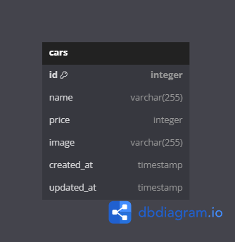

# Car Management Dashboard
Challenge-6

## Entity Relationship Diagram


## Endpoints

### Cars
| No | URI                          | Method    | Description                              |
| -- | ----------------             | --------- | ---------------------------------------- |
| 1  | /cars                        | GET       | Get cars                                 |
| 2  | /cars/:id                    | GET       | Get car by id                            |
| 2  | /cars                        | POST      | Create car                               |
| 4  | /cars/:id                    | DELETE    | Delete car                               |
| 5  | /cars/:id                    | PUT       | Update car                               |

## Sample request and response

### Melihat Daftar Mobil yang Tersedia dalam Database
#### Request Body
```GET /cars```

#### Response Body
```json
[
  {
    "id": 1,
    "name": "Toyota Camry",
    "price": 35000,
    "image": "toyota_camry.jpg",
    "created_at": "2023-11-10T12:00:00.000Z",
    "updated_at": "2023-11-10T12:00:00.000Z"
  },
  {
    "id": 2,
    "name": "Honda Civic",
    "price": 30000,
    "image": "honda_civic.jpg",
    "created_at": "2023-11-10T12:30:00.000Z",
    "updated_at": "2023-11-11T10:30:00.000Z"
  }
]
```


### Melihat Daftar Mobil yang Tersedia dalam Database berdasarkan Id
#### Request Body
```GET /cars/1```

#### Response Body
```json
[
  {
    "id": 1,
    "name": "Toyota Camry",
    "price": 35000,
    "image": "toyota_camry.jpg",
    "created_at": "2023-11-10T12:00:00.000Z",
    "updated_at": "2023-11-10T12:00:00.000Z"
  }
]
```


### Menambahkan Data Mobil
#### Request Body
```POST /cars```
```json
[
  {
    "name": "Ford Mustang",
    "price": 45000,
    "image": "ford_mustang.jpg"
  }
]
```

#### Response Body
```json
[
  {
    "id": 3,
    "name": "Ford Mustang",
    "price": 45000,
    "image": "ford_mustang.jpg",
    "created_at": "2023-11-10T12:00:00.000Z",
    "updated_at": "2023-11-10T12:00:00.000Z"
  }
]
```


### Menghapus Data Mobil yang Sudah Ada
#### Request Body
```DELETE /cars/3```

#### Response Body
```json
[
  {
    "message": "Mobil dengan ID 3 telah dihapus."
  }
]
```


### Memodifikasi Data Mobil yang Sudah Ada
#### Request Body
```POST /cars/2```
```json
[
  {
    "name": "VW Kodok",
    "price": 25000
  }
]
```

#### Response Body
```json
[
  {
    "id": 2,
    "name": "VW Kodok",
    "price": 25000,
    "image": "honda_civic.jpg",
    "created_at": "2023-11-10T12:30:00.000Z",
    "updated_at": "2023-11-11T10:30:00.000Z"
  }
]
```

